# Titanic-in-R

# Code:
https://github.com/trajceskijovan/Titanic-in-R/blob/main/Titanic%20in%20R_ver2.R

# EDA
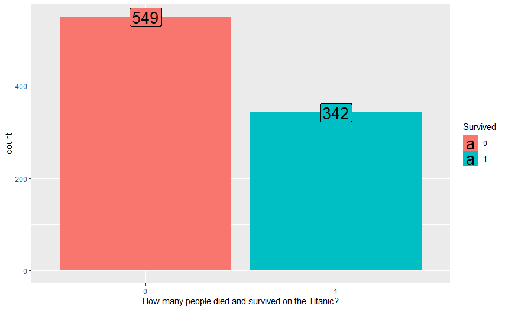
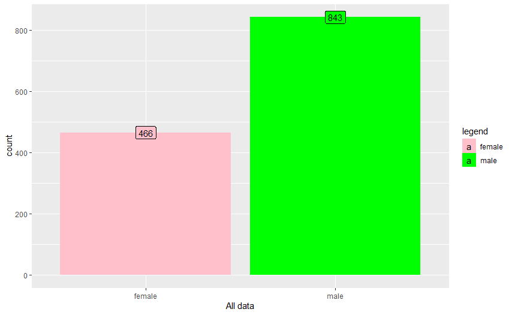
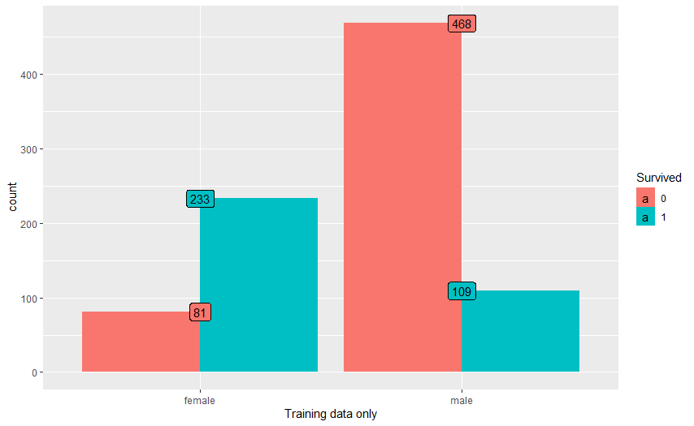

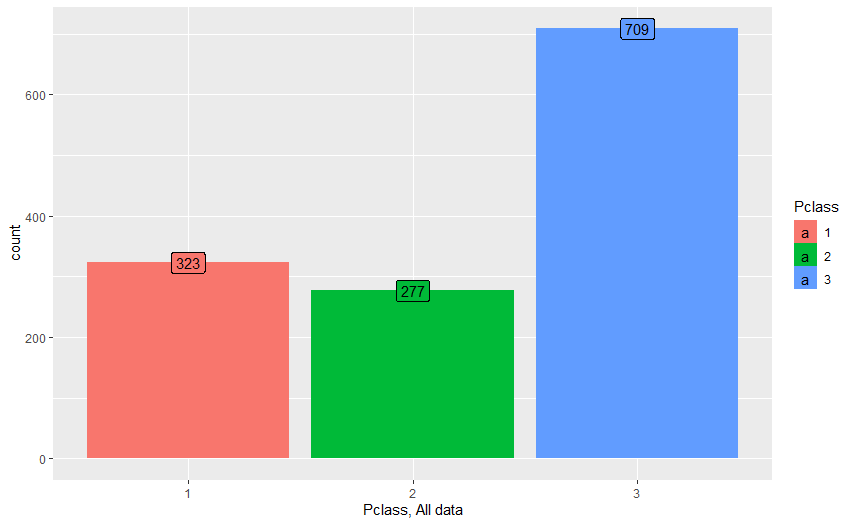
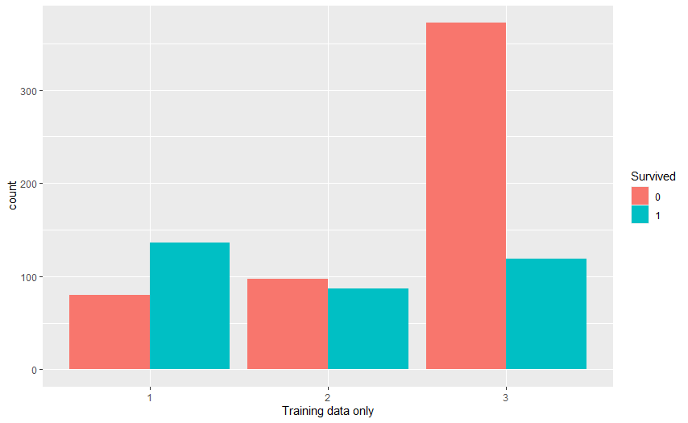
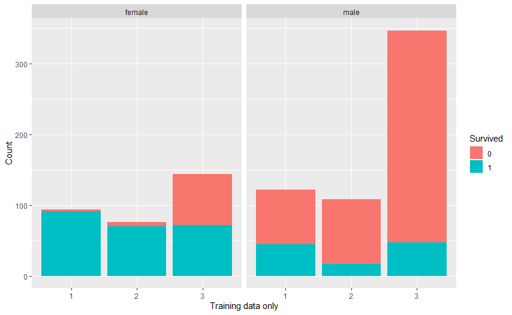

# Passenger class:
1. Most passengers are from 3rd class
2. A majority of first-class passengers survived, and most people in 3rd class died
3. It seems that survival is strongly correlated with the passenger class
4. Women in 1st and 2nd class had more chance to survive. For men, 2nd class was almost as bad as 3rd class

# Survived against Fsize(family size):
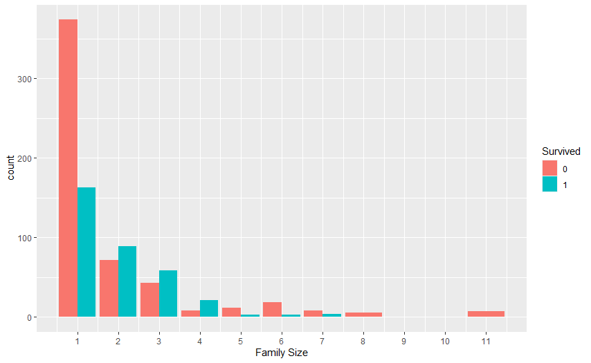
1. Solo travelers had a much higher chance to die than to survive.
2. People traveling in families of 2-4 people had a relatively high chance to survive than to die
3. People traveling in families of 5+ people had a lower chance to survive

# Plot survived against Age with density plot 
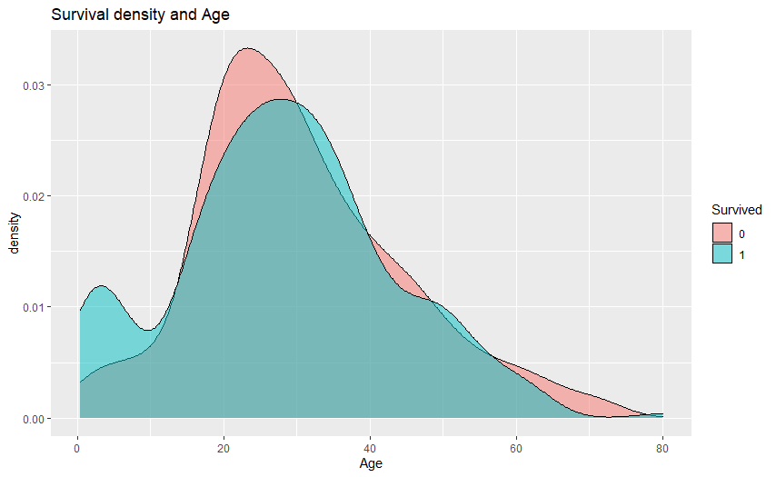
Survival chances of ages 20-30 are low

#  Plot survived against Age with boxplot 
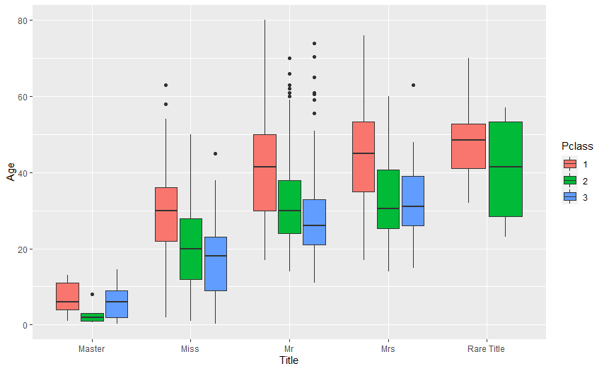
1. Title and Pclass seem the most important predictors for Age
2. “Masters” are all very young

# Plot Embarked against Survived
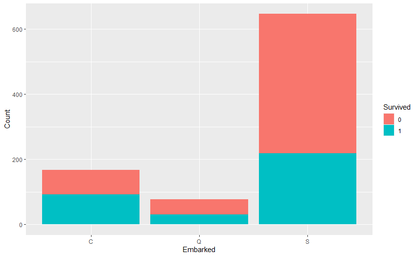
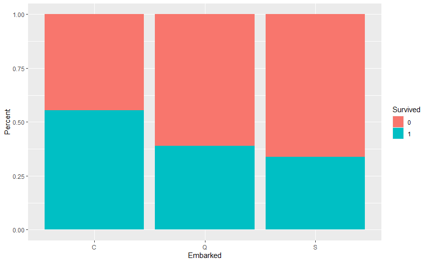
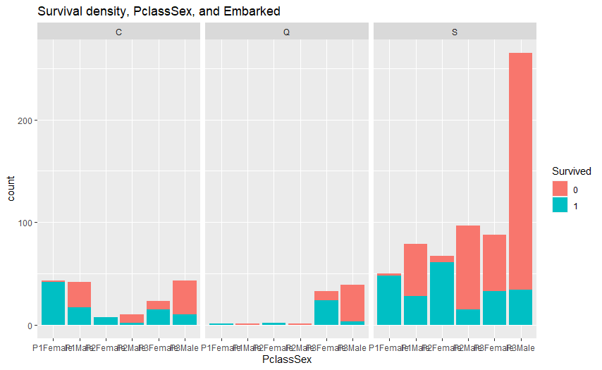

1. Many 1st class passengers boarded at Cherbourg
2. Southampton survival rates are worse than Cherbourg in all Pclass/Sex combinations
3. Cherbourg survival rates are better than Queenstown
4. Almost all Queenstown passengers boarded 3rd class
5. For Queenstown, within 3rd class, female survival rate is better than Cherbourg and male survival rate is worse than Cherbourg
6. Most of male victims in 2nd class and 3rd class were boarded at Southampton.

# Plot survived against children
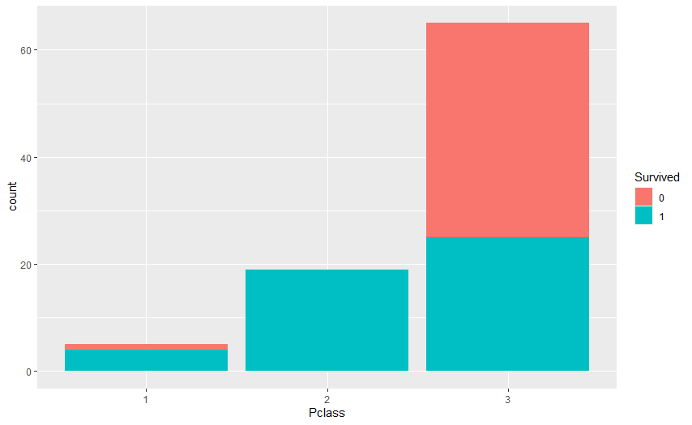

1. All children in P2 survived
2. Most children in P3 die
3. Consider excluding P3 from the Child

# Adding an “ Solo” variable" based on Siblings and Spouse
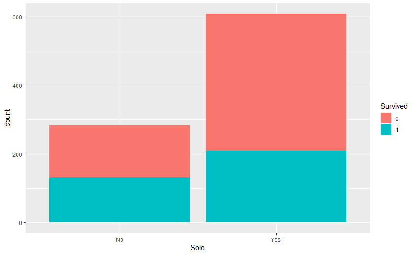

